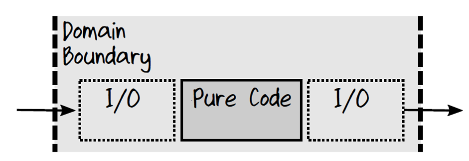
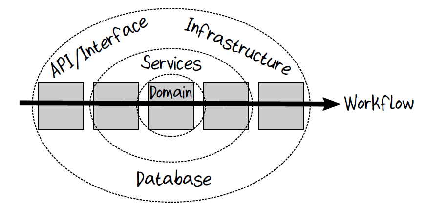

# Domain Modeling Made Functional -- Microwave example

This project shows the evolution of a project using domain-driven design and domain modeling with types using F#.

Each stage is implemented as a branch: `v1`, `v2`, etc. To see the code evolve, switch to the next branch.
The branches are described in detail below.

## Project structure

There are two components:

* `Microwave.Core` contains the pure domain code, written in F#. This consists of three files:
  * `Domain.fs` contains the domain model -- the "interface" as it were.
  * `Implementation.fs` contains the implementation of the domain
  * `Api.fs` contains the C#-friendly API for accessing the model and implementation.
* `Microwave.Web` contains the web front end (controllers), written in C#
  * There is one controller (`MicrowaveController`) and one view (`Microwave/Index`).
  * There is a very crude UI with a separate button for each command ("Open", "Close", "Start", etc).
    The button triggers a method on the controller which in turn will call the API.

These components are combined in the solution file `Microwave.sln`.

The project is built on .NET Core and should work on all platforms. For installation and usage instructions, see below.

There is also a `DomainFormatter` project that formats the code and markdown comments as HTML.

## Running the web application

To run the app from the command line, do:

```text
cd Microwave.Web
dotnet run
```

And then open a browser to:

```text
http://localhost:5000
```

## Formatting the Domain.fs file

The `DomainFormatter` project will convert the `Domain.fs` file into HTML and store the output in `doc\Domain.html`

To run from the command line, do:

```text
cd DomainFormatter
dotnet run ..\Microwave.Core
```

NOTE: You can ignore the warnings "warning NU1701: ... was restored using a different framework"

----

## The stages of evolution

The following sections describe each branch and how the code changes between them.

## Branch `v1`

This is a skeleton project with no functionality.

* The F# files are minimal templates, with no code.
* The C# controller does not call the API but instead returns dummy data.

----

## Branch `v2`

This is a first pass at a domain model. Only `Domain.fs` has been updated.

In this pass:

* We first document all the commands that can happen.
  * In this case, we do it by looking at the buttons on the UI below -- Start, Stop, etc. In more complex business domains, these can come from event storming sessions.
  * We'll start with simplest set of commands -- Start and Open/Close the door -- and then evolve from there as we learn more about the domain and we get feedback from prototypes.
    There's no point implementing complex operations like "popcorn" until we understand what the simple operations involve. We need to be sure that we have a shared mental model of the basics before adding advanced features.


* The `Start` command needs a `HowLong` field, so we create a special `TimeRemaining` type rather than using a simple `int`.
  * Later, the `TimeRemaining` type will have constraints (e.g. must be > 0)
  * We also want to make it clear TimeRemaining uses seconds, so we defined a `second` units of measure

Next, we document all states: running, door open, etc.

* In the comments, we list some business rules. We want to ensure that these rules are conformed to.
  * The microwave cannot be running if the door is open
  * The microwave cannot be running if the TimeRemaining = 0
* There are two ways to model the state of the microwave:
  * Using a record or struct with flags for each state: "IsOpen" and "IsRunning" flags, and optional field for data that is only needed in some states ("TimeRemaining option")
  * A much better way is to use as choice type, as shown in the code.

If we run the the `DomainFormatter` tool now, we can see the updated documentation at `doc\Domain.html`

Summary of this version:

* We have a basic domain model that can be shared and critiqued.
* Choice types are a very powerful tool for domain modelling, especially for modelling states.

----

## Branch `v3`

In this version, we document all the state transitions.

The first guideline is that we never do any hidden I/O. We assume that all data is available in memory.
If we need to load or save state (e.g. using a database) we do this at the edge, not in the core.
This way the core code is "pure" and predictable -- a particular input always gives the same output -- which in turn
makes it very easy to test.

As soon as we start documenting the state transitions, we realize that we can open the door when running,
and so there is a difference between "idle" and "running".

As a result, we update the `State` type to have four choices, the new one being `DoorOpenPaused`. The other non-running ones are renamed with "Idle".

Next we start documenting the state transitions, like this:

```fsharp
type OpenWhenIdle =
    OpenCommand -> State -> State

type CloseWhenIdle =
    CloseCommand -> State -> State
```

But these are not very informative -- they all look the same!

By using the type associated with each state instead, rather than the state as a whole,
the actions become much clearer.

```fsharp
type OpenWhenIdle =
    OpenCommand -> DoorClosedIdleState -> DoorOpenIdleState

type CloseWhenIdle =
    CloseCommand -> DoorOpenIdleState -> DoorClosedIdleState
```

The addition of the "Paused" state also leads us to a new rule:

* When restarted after pause, TimeRemaining must be the same as when pause happened.

Do we need to test for this rule, or can we check it just by looking at the domain model?

Well, if we look at the type of the `CloseWhenRunning` action it outputs a `RunningState`.
In order to construct a `RunningState`, we need a `TimeRemaining` value. This value is not available in `CloseCommand` so it has to come from `DoorOpenPausedState`

```fsharp
type CloseWhenRunning =
    CloseCommand -> DoorOpenPausedState -> RunningState
```

Where does the `TimeRemaining` value in `DoorOpenPausedState` come from? It can only come from the `RunningState` at the time the door was opened.

```fsharp
type OpenWhenRunning =
    OpenCommand -> RunningState -> DoorOpenPausedState
```

So just by defining the types in a certain way, we can have very high confidence that the rule is satisfied.

If we run the the `DomainFormatter` tool now, we can see the updated documentation at `doc\Domain.html`

Summary of this version:

* We can document verbs (`OpenWhenIdle`) as well as nouns (`State`) in the domain.
* We can continue encoding business rules in the types, minimizing the need for tests.
* We have completed the domain model (for now). Is it understandable?

----

## Branch `v4`

Now let's build the implementation based on the domain model.

In this case we only need to implement the five transitions.

To implement a transition using the definitions in the `Domain.fs` file, we define a function with the required type, like this:

```fsharp
let start : Start =
    fun cmd currentState ->
```

and then fill in the details:

```fsharp
let start : Start =
    fun cmd currentState ->
        printfn "Started by %s " cmd.User
        let newStateInfo : RunningState =  // use a type annotation here to not mix up with DoorOpenPausedState
            {TimeRemaining = cmd.HowLong}
        newStateInfo
```

It's quite hard to get the implementation wrong because the definition of the `Start` type constrains the inputs and output so much.

There's a well known book called ["Growing Object-Oriented Software Guided by Tests"](http://www.growing-object-oriented-software.com/).
This approach could be called "Growing Functional Software Guided by Types".

And as noted earlier, these types give us confidence for things that we would normally write tests for. For example, we've seen that rules
such as "the microwave cannot be running if the door is open" or "when restarted after pause, TimeRemaining must be the same" can be checked just by looking at the definitions.

----

## Branch `v5`

Finally, we can implement the API.

For each action, we will

* Load the state from the database
  * The database for this example is just a global mutable value, hidden in a `Database` module :)
* Construct the appropriate command
* Handle each possible case that the state can be in (Open, Closed, Running, etc)
* Save the state into the database if it has changed

Because we have kept the core domain and implementation pure, the implementation is easy to test.
The API (or other top-level layer) is then responsible for "wiring" everything up and managing the state.

That is, we keep the I/O at the edges like this:



If we do this, then we naturally fall into the Onion Architecture.



### Creating an ApiResult type

In F#, matching on each possible state is an *expression*, which means that each branch must return a value of the same type.
For example, the code below will not compile:

```fsharp
// for each possible state, handle the command
match currentState with
| DoorClosedIdle stateInfo ->
    let newStateInfo = Implementation.openWhenIdle cmd stateInfo
    let newState = DoorOpenIdle newStateInfo
    Database.saveState newState
    // this branch returns nothing
| DoorOpenIdle stateInfo ->
    let errMsg = "Can't open door when door is already open"
    errMsg
    // this branch returns a string
```

Instead, all branches must return the same thing, so we'll define a new type called `ApiResult` which contains the state and a (possibly blank) error message.

```fsharp
type ApiResult = {
    State : State
    Error : string
    }
```

Next, we adjust the code so that *all* branches return an `ApiResult`, whether they succeed or fail.

```fsharp
match currentState with
| DoorClosedIdle stateInfo ->
    let newStateInfo = Implementation.openWhenIdle cmd stateInfo
    let newState = DoorOpenIdle newStateInfo
    Database.saveState newState
    // return the new state and a blank error message
    {State = newState; Error = ""}
| DoorOpenIdle stateInfo ->
    let errMsg = "Can't open door when door is already open"
    // return the original state and an error message
    {State = currentState; Error = errMsg }
```

The use of a choice type to represent the different states will help to guide the implementation.
When using `match currentState with ...`, every case must be handled. If you forget to handle one, you will get a green squiggle under the `state`
and a warning saying something like:

```text
warning FS0025: Incomplete pattern matches on this expression. For example, the value 'DoorOpenPaused (_)' may indicate a case not covered by the pattern(s).
```

Only when you have successfully matched *all* the cases will the error go away.
(You can see this for yourself if you comment out one of the cases in the existing code.)

### Calling the Api from a C# controller

Now we can finally change the C# code to use the API.

```csharp
public IActionResult Start(int howLong)
{
    var result = Microwave.Api.Start(howLong);
    ViewData["State"] = Microwave.Api.StateToString(result.State);
    ViewData["ErrorMessage"] = result.Error;
    return View("Index");
}


public IActionResult Open()
{
    var result = Microwave.Api.Open();
    ViewData["State"] = Microwave.Api.StateToString(result.State);
    ViewData["ErrorMessage"] = result.Error;
    return View("Index");
}
```

The `State` type is not something that the C# code knows about, so the F# Api will also provide a function (`Api.StateToString`) to convert it into a string.
For now, we'll just do a crude implementation by formatting the value with `sprintf`.

### The first prototype is ready

At this point we can run `Microwave.Web` to open up a web site that users can interact with. Having a crude prototype means that we can get feedback immediately.

For example, some feedback might be:

* You shouldn't be able to enter negative numbers when specifying how long to run it for!
* When started, the microwave doesn't actually count down the seconds
* There's no way to stop the microwave after it has started

We will address these issues in the next few iterations.

----

## Branch `v6`

Let's evolve the design now.

* We'll add a constraint on TimeRemaining
* We'll change the error from a string type to a special error type

### Add a constraint on TimeRemaining

We said earlier that `TimeRemaining` must be constrained to be positive.
To implement that, we'll make the constructor private and then add a module with the same name to hold a constructor function.
(The module could be added at the bottom of the file if we like, but it's easier if it is adjacent to the type).

```fsharp
type TimeRemaining = private TimeRemaining of int<second>  // NEW: the constructor is now private

module TimeRemaining =

    /// Construct a TimeRemaining, or return None
    let create t =
        if t > 0<second> then
            Some (TimeRemaining t)
        else
            None
```

As soon as this is added, we get a compiler error in the Api code:

```fsharp
let Start(howLong) =
    ...
    let timeRemaining = TimeRemaining howLong  // an error
```

We need to change it to use the constructor

```fsharp
let Start(howLong) =
    let timeRemaining = TimeRemaining.create howLong  // create a TimeRemaining value from the parameter passed in.
```

But this fix causes new compiler errors in the following lines because the constructor returns an *option* not a normal `TimeRemaining`.
We are thus forced to handle both the `None` case and the `Some` case. In the `None` case, we'll return an error message, and in the `Some` case
we'll use the previous code.

```fsharp
let Start(howLong) =
    let currentState = Database.loadState()
    let timeRemainingOpt = TimeRemaining.create howLong  // create a TimeRemaining value from the parameter passed in.
    match timeRemainingOpt with
    | None ->
        let errMsg = "Time to run for must be positive"
        {State = currentState; Error = errMsg }
    | Some timeRemaining ->
        let cmd : StartCommand = {User = "Scott"; HowLong = timeRemaining }
        match currentState with
        | ...
```

With this change, it is impossible for the microwave to be running when TimeRemaining = 0. This is because the `Running` state requires a `TimeRemaining` value,
and a `TimeRemaining` can only be created when the inut value is not 0. So, this is another business rule we don't need to write a test for.

### Change the error from a string type to a special error type

The second thing we will do is get rid of the error strings and replace them with an "enum" or choice type.

Before:

```fsharp
| DoorOpenIdle stateInfo ->
    let errMsg = "Can't open door when door is already open"
    {State = currentState; Error = errMsg }
```

And after:

```fsharp
| DoorOpenIdle stateInfo ->
    let errMsg = CantOpenDoorWhenDoorIsAlreadyOpen
    {State = currentState; Error = errMsg }
```

For this to work, we define an `Error` type in the `Domain.fs` and create a choice for each possible error:

```fsharp
type Error =
    | CantUseNegativeTimeRemaining
    | CantCloseDoorWhenDoorIsAlreadyClosed
    | CantOpenDoorWhenDoorIsAlreadyOpen
    | CantStart
    | NoError
```

We also change the `ApiResult` type to use this type:

```fsharp
type ApiResult = {
    State : State
    Error : Error
    }
```

Not every operation causes an error, so we could make the error field optional.
However, to keep it simple for the C# code, we'll just include a `NoError` choice.

We also need to provide a function (`Api.ErrorToString`) to convert the error type into a string. We can even pass in a language here so that we can do translations!

```fsharp
/// Convert the error into a string for display in the UI
let ErrorToString(lang, error) =
    match error with
    | NoError ->
        ""
    | CantUseNegativeTimeRemaining ->
        "Can't Use Negative Time"
    | CantCloseDoorWhenDoorIsAlreadyClosed ->
        match lang with
        | "fr-FR" ->
            "Impossible de fermer la porte quand la porte est déjà fermée"
        | _ ->
            "Can't Close Door When Door Is Already Closed"
    | CantOpenDoorWhenDoorIsAlreadyOpen ->
        "Can't Open Door When Door Is Already Open"
    | CantStart ->
        "Can't Start"
```

and the C# code needs to change slighly to accomodate this:

```csharp
public IActionResult Start(int howLong)
{
    var result = Microwave.Api.Start(howLong);
    ViewData["State"] = Microwave.Api.StateToString(result.State);
    ViewData["ErrorMessage"] = Microwave.Api.ErrorToString("en-GB", result.Error);
    return View("Index");
}
```

The advantages of using an `Error` type like this are:

* It's documentation of everything that can go wrong.
  * And if a new thing can go wrong, it has to be added to the list of choices otherwise the code won't compile.
* It enforces consistency. Everyone will be forced to pick from the same list of errors.
* It helps with internationalization and localization by removing all strings from the core domain.

----

## Branch `v7`

We'll do one more iteration to evolve the design again.

* We'll add a countdown timer so that the microwave runs to 0
* We'll add a "Stop" command

### Adding a timer

We want the microwave to actually count down the seconds, so we need to:

* Add a `Timer` module (this is in the `Api.fs` file) with a timer that ticks on every second.
* When the microwave goes into the `Running` state, start the timer. Example code below:

```fsharp
let Start(howLong) =
    ...
    match currentState with
    | DoorClosedIdle stateInfo ->
        let newState = Running newStateInfo
        Timer.start()  // start the timer when transitioning to the Running state
```

* When the microwave leaves the `Running` state, stop the timer.
* Add a handler for the timer tick event that decrements the time remaining.
  When it reaches zero, change the state to `DoorClosedIdle`. Example code below:
  * Note that we are forced to handle this case, as TimeRemaining is not valid for 0 seconds.

```fsharp
let handleTick() =
    let currentState = Database.loadState()
    match currentState with
    | Running info ->
        let newTimeRemainingOpt = decrementTimeRemaining info.TimeRemaining
        let newState =
            match newTimeRemainingOpt with
            | None ->
                timer.Stop()  // stop the timer when leaving the Running state
                // Go to the idle state
                DoorClosedIdle DoorClosedIdleState
            | Some newTimeRemaining ->
                // Go to a new Running state, with one second less
                Running {info with TimeRemaining=newTimeRemaining}
        Database.saveState newState
    | _ ->
        // in all other cases, do nothing
        ()
```

All the new code is in the `Api.fs` file.

### Adding a Stop command -- Part 1 -- Updating the domain.

Looking at the control panel picture above, we can see a "Stop" button. Let's add that as well.

To do this, we start by updating the domain.

First we create a `StopCommand` and add it to the `Domain.fs` file:

```fsharp
type Command =
    | Open of OpenCommand
    | Close of CloseCommand
    | Start of StartCommand
    | Stop of StopCommand

// information associated with the Stop command
type StopCommand = {
    User : UserId
    }
```

And then we create some `Stop` actions and also add them to the `Domain.fs` file.
In this case we have created a separate case for stopping while running vs stopping while paused.

```fsharp
type StopWhenRunning =
    StopCommand -> RunningState -> DoorClosedIdleState

type StopWhenPaused =
    StopCommand -> DoorOpenPausedState -> DoorClosedIdleState
```

At this point, if we run the the `DomainFormatter` tool now, we can see the updated documentation, with the new Stop command, at `doc\Domain.html`

### Adding a Stop command -- Part 2 -- Updating the implementation and the API.

Next, we need to implement the `Stop` actions in the `Implementation.fs` file

```fsharp
let stopWhenRunning : StopWhenRunning =
    fun cmd currentState ->
        printfn "Stopped by %s " cmd.User
        let newStateInfo = DoorClosedIdleState
        newStateInfo
```

At this point we can unit test the implementation if need be.

Once we are happy with the implementation, we can add the required code to the `Api.fs` file

```fsharp
let Stop() =
    let currentState = Database.loadState()
    let cmd : StopCommand = {User = "Scott"}

    // internal helper function to handle logic common to multiple branches
    let changeState newStateInfo =
        let newState = DoorClosedIdle newStateInfo
        Database.saveState newState
        Timer.stop()  // stop the timer when leaving the Running state
        {State = newState; Error = NoError}

    match currentState with
    | Running stateInfo ->
        let newStateInfo = Implementation.stopWhenRunning cmd stateInfo
        changeState newStateInfo
    | DoorOpenPaused stateInfo ->
        let newStateInfo = Implementation.stopWhenPaused cmd stateInfo
        changeState newStateInfo
    // we can match all the unhandled states together, like this
    | DoorOpenIdle _
    | DoorClosedIdle _ ->
        let errMsg = CantStart
        {State = currentState; Error = errMsg }
```

### Adding a Stop command -- Part 3 -- Updating the web project

In the `Microwave.Web` project, we now just need to add a button in the view, and a method on the controller that calls the new Api function.

```csharp
public IActionResult Stop()
{
    var result = Microwave.Api.Stop();
    ViewData["State"] = Microwave.Api.StateToString(result.State);
    ViewData["ErrorMessage"] = Microwave.Api.ErrorToString("en-GB", result.Error);
    return View("Index");
}
```

And now we're done. We can run the `Microwave.Web` project again and start and then stop the microwave.

----

## Final comments

* We've seen how to evolve a project starting from a few line of code to a complete working prototype.
* We've seen how to capture the core features of the domain using types
* We've seen how these domain types guide the implementation.
* We've seen how to use types to make illegal states unrepresentable. For example, it is not possible for the microwave to be running with door open.
* We've seen how to separate I/O (database storage in this case) from the pure domain logic.
* We've seen how to create a C# friendly API in F# and how this API can be called from C# without knowing anything about the F# implementation.
  * For fun, you can open up the F# DLL in a decompiler like DotPeek or ILSpy to see what the F# code would look like in C#!
* Finally, we've seen how we can evolve the domain and implementation without tending to create a big ball of mud.
